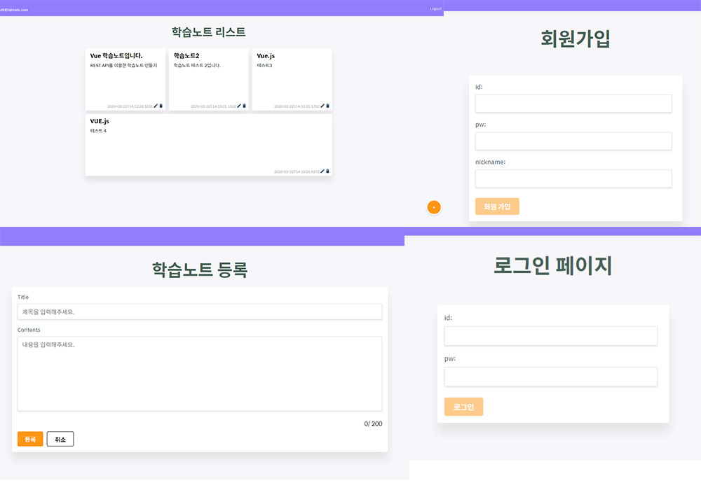

# Vue.js 학습 노트 애플리케이션

> REST API를 이용한 CRUD기능의 학습노트 애플리케이션입니다.



## 설치방법

```
# 패키지 설치
npm install

# 개발 환경 실행
npm run serve
```

## node.js 서버 실행방법

[서버 코드 레포지토리 바로가기](https://github.com/nohsunghyung/vue-learning-server)

## 주요 기술 스택
* Vue.js
* Vue Router
* Vuex
* Axios
